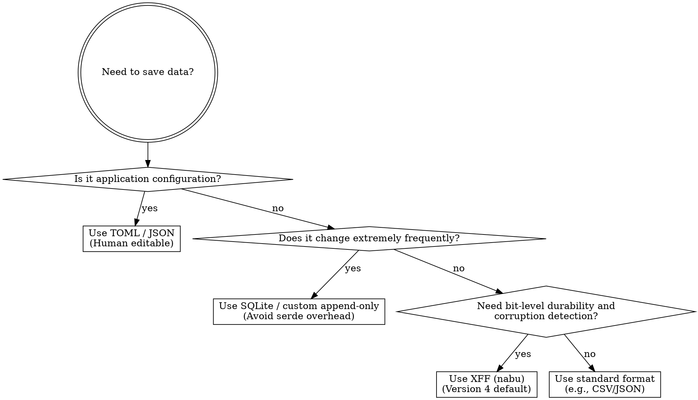

# Using XFF Files

## Overview
XFF (Xqhare File Format) is a custom binary format designed for long-term data preservation. 
* **Nabu** handles the **physical** (on-disk) representation (CRC-32 checksums, even-parity marker bytes).
* **Aequa** (via `XffValue`) handles the **logical** (in-memory) representation.

## When to Use



### Correct Circumstances (Use XFF)
* **Long-Term Storage**: When data durability and bit-level integrity are paramount.
* **Binary Blobs**: If you need to store binary data, prefer using `nabu` to store it as a native `XffValue::Data` blob. **Never base64/binary-to-text encode binary data inside JSON, TOML, or CSV.**
* **Whole Unit Read/Write**: When the files are naturally read or written in their entirety as a single logical unit.

### Incorrect Circumstances (Avoid XFF)
* **Configuration Files**: **Never use XFF for application configuration.** Configurations must be easily inspected and edited by hand without specialized tooling. Use TOML or JSON instead.
* **High-Frequency Writes**: The CPU cost of recalculating CRC-32 and parity bytes makes it inefficient for highly volatile data (e.g. caches).

## Version Lifecycle & Upgrades
* **Auto-Upgrades**: Standard `read` auto-detects older versions (v0-3) and parses them. Standard `write` always writes the latest version (v4). Reading an old file and writing it back automatically upgrades the format.
* **Production Rule**: In production, always use `write()` to keep files upgraded. `write_legacy()` is reserved exclusively for testing.

## Code Reference
```rust
use nabu::serde::{read, write};
use nabu::XffValue;

// Writing (implicitly defaults to latest v4)
let val = XffValue::from("data");
write("data.xff", val).unwrap();

// Reading (auto-detects and upgrades v0-3 to v4 in-memory)
let parsed = read("data.xff").unwrap();
```

## Common Mistakes
* Proposing XFF for `.toml` configuration replacements.
* Using `write_legacy()` in production environments.
